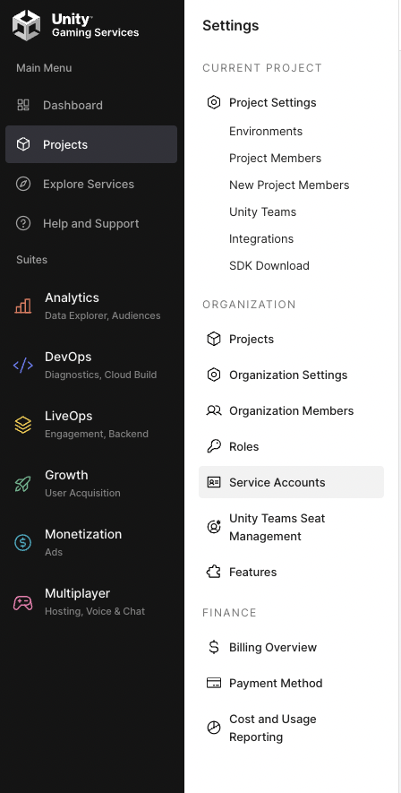

# UCVD SOLO Datasets

###### Getting API Token

- Create a Unity account if you don't at [Unity Services](https://dashboard.unity3d.com/)
- Navigate to Projects and create a project if you don't have one.
- Navigate to Projects>Service Account in the dashboard to create a new one.

- Generate your API key.
- Save your API key somewhere safe, it will be used later.
- Navigate to Projects>Select the project to use and record the `Project ID`.
- Navigate to Projects>Orgaization Settings and record the `Organization ID`.


###### Downloading datasets from UCVD

```python
from pysolotools.clients import UCVDClient
client = UCVDClient(
    org_id="unity-org-id",
    project_id="unity-project-id",
    sa_key="sa-key",
    api_secret="api-secret"
)

client.download_dataset_archives("<<dataset-id>>")

```
